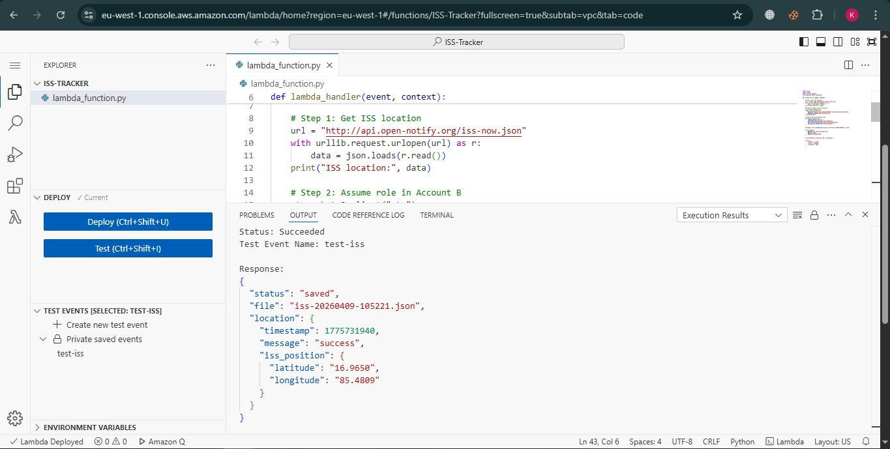
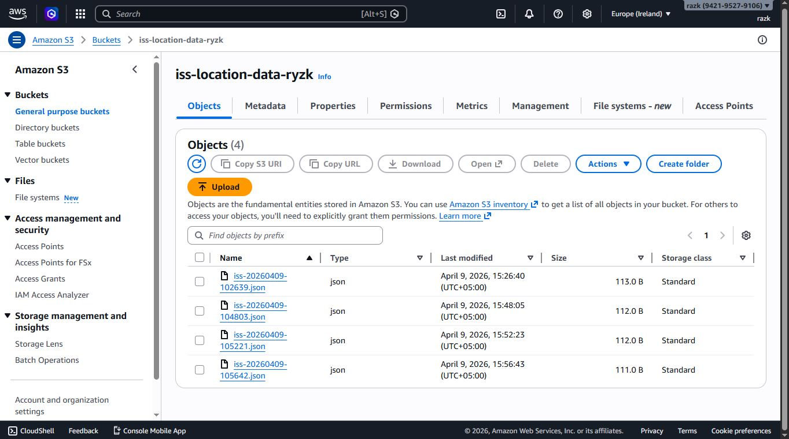
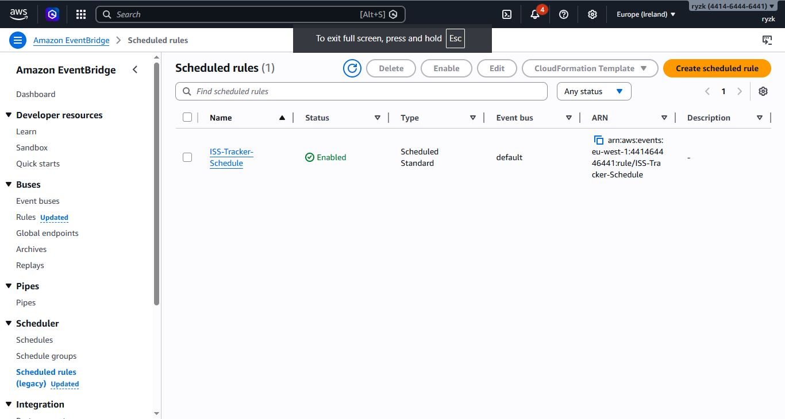
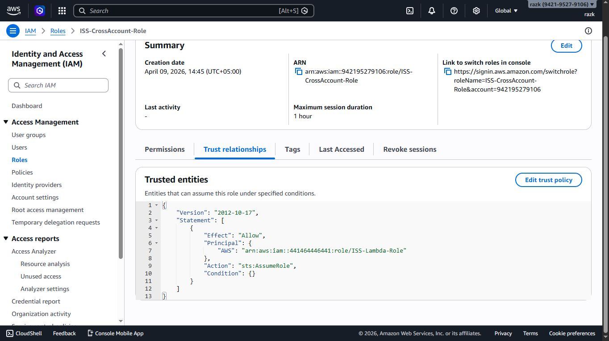

# ISS Cross-Account Tracker

Hi 
This is a serverless AWS project that tracks the International Space Station in real time using **cross-account IAM roles**, **STS AssumeRole**, **Python Lambda**, and **EventBridge** — running fully automated with zero permanent credentials.

---

## Architecture

```
Account A (Operations)                    Account B (Data)
─────────────────────                    ────────────────
EventBridge (rate: 5 min)
        ↓
Lambda (Python 3.12)
  ISS-Lambda-Role
        │
        │ 1. Calls free ISS API
        │    api.open-notify.org
        │
        │ 2. sts:AssumeRole →→→→→→→→→→  ISS-CrossAccount-Role
        │                                (trust: ISS-Lambda-Role only)
        │
        │ 3. Writes with temp creds →→→  S3 Bucket
        │                                iss-location-data/
        │                                iss-20260409-102639.json
        │                                iss-20260409-103145.json
        │                                ...
```

---

## Why STS AssumeRole (Not Access Keys)

| Access Keys | STS AssumeRole |
|---|---|
| Permanent credentials | Temporary — expire after 1 hour |
| Stored in code or env vars | Never stored anywhere |
| If leaked → permanent breach | If leaked → expires automatically |
| Manually rotated | Auto-rotated by AWS |

This is how every enterprise AWS environment works. Netflix, Amazon, every large org separates workloads across accounts and uses STS for cross-account access.

---

## Project Structure

```
iss-cross-account-tracker/
├── lambda_function.py              # Python Lambda code
├── iam/
│   ├── account-a-lambda-role-policy.json   # STS AssumeRole permission
│   └── account-b-trust-policy.json         # Cross-account trust policy
├── screenshots/
│   ├── lambda-test-succeeded.jpg
│   ├── lambda-code.jpg
│   ├── eventbridge-schedule.jpg
│   ├── iam-lambda-role.jpg
│   ├── iam-crossaccount-trust.jpg
│   ├── s3-objects.jpg
│   └── s3-json-contents.jpg
└── README.md
```

---

## How to Build This

### Prerequisites
- Two separate AWS accounts
- AWS Console access on both

---

### Step 1 — Account B: Create S3 Bucket
S3 → Create bucket
- Name: `iss-location-data-[yourname]`
- Region: `eu-west-1`
- Block all public access: **ON**

---

### Step 2 — Account B: Create Cross-Account IAM Role
IAM → Roles → Create role → **Another AWS account** → enter Account A ID

Role name: `ISS-CrossAccount-Role`

Add inline policy (`iss-s3-write-policy`):
```json
{
  "Version": "2012-10-17",
  "Statement": [
    {
      "Effect": "Allow",
      "Action": ["s3:PutObject"],
      "Resource": "arn:aws:s3:::YOUR_BUCKET_NAME/*"
    }
  ]
}
```

Edit trust policy to restrict to Lambda role only (least privilege):
```json
{
  "Version": "2012-10-17",
  "Statement": [
    {
      "Effect": "Allow",
      "Principal": {
        "AWS": "arn:aws:iam::ACCOUNT_A_ID:role/ISS-Lambda-Role"
      },
      "Action": "sts:AssumeRole"
    }
  ]
}
```

---

### Step 3 — Account A: Create Lambda Execution Role
IAM → Roles → Create role → **AWS Service → Lambda**

Role name: `ISS-Lambda-Role`

Attach: `AWSLambdaBasicExecutionRole`

Add inline policy (`iss-sts-assume-policy`):
```json
{
  "Version": "2012-10-17",
  "Statement": [
    {
      "Effect": "Allow",
      "Action": "sts:AssumeRole",
      "Resource": "arn:aws:iam::ACCOUNT_B_ID:role/ISS-CrossAccount-Role"
    }
  ]
}
```

---

### Step 4 — Account A: Create Lambda Function
Lambda → Create function
- Name: `ISS-Tracker`
- Runtime: Python 3.12
- Execution role: `ISS-Lambda-Role`

---

### Step 5 — Add Python Code
See `lambda_function.py` in this repo.

Click **Deploy**

---

### Step 6 — Add EventBridge Trigger
Lambda → Configuration → Triggers → Add trigger
- Select: **EventBridge**
- Rule name: `ISS-Tracker-Schedule`
- Schedule: `rate(5 minutes)`

---

### Step 7 — Test
Lambda → Test → empty JSON `{}` → Run

Check Account B → S3 bucket for new JSON files appearing every 5 minutes.

---

## Screenshots

### Lambda Test Succeeded


### S3 Objects in Account B


### EventBridge Schedule


### IAM Cross-Account Trust Policy


### ISS-Coordinates


---

##  What This Teaches

| Concept | Detail |
|---|---|
| STS AssumeRole | Exact mechanism for cross-account access |
| Least privilege IAM | Trust policy scoped to specific role only |
| Serverless automation | EventBridge triggers Lambda with no servers |
| Cross-account S3 | Resource-based + identity-based policy interaction |
| Temporary credentials | Zero permanent keys stored anywhere |

---

##  Real World Use Case

Large companies like Netflix separate environments across AWS accounts — production, staging, data, security all in separate accounts. Cross-account roles with STS is the standard pattern for allowing services in one account to interact with resources in another — without sharing permanent credentials.

---

##  Technologies Used

- AWS Lambda (Python 3.12)
- AWS STS (AssumeRole)
- Amazon S3
- Amazon EventBridge
- AWS IAM (cross-account roles)
- Open Notify ISS API (free, no auth required)
